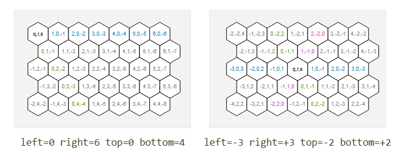

Bestagons is a PHP library for creating and managing hexagonal maps using axial and cube coordinates.
It is based on the excellent hex grid logic and algorithms from [Red Blob Games](https://www.redblobgames.com/grids/hexagons/).

## Installation

You can install the package via Composer:

```bash
composer require stui/bestagons
```

## Usage

### The Hex Class

The `Hex` class represents a hexagon in a grid.
It can be represented using axial coordinates ($q$, $r$) or cube coordinates ($q$, $r$, $s$). Bestagon can handle both and in fact will always store cube coordinates internally.

```php
use Stui\Bestagons\Hex\Hex;

$hex = new Hex(1, 2);
echo $hex->q; // 1
echo $hex->r; // 2
echo $hex->s; // -3 (calculated automatically)
```
#### Equality

```php
$hex = new Hex(1, 0);
$hex->equal(new Hex(0, 1)); // false

$hex = new Hex(1, 0);
$hex->equal(new Hex(1, 0)); // true
```

#### Coordinate arithmetic

```php
$hex1 = new Hex(1, 0);
$hex2 = new Hex(0, 1);

$sum = $hex1->add($hex2);
$diff = $hex1->subtract($hex2);
$scaled = $hex1->multiply(2);
```

#### Distance and Neighbors
For help with directions, please see [here](https://www.redblobgames.com/grids/hexagons/#neighbors).

For a quick reference, the directions - expressed in cardinal directions - are:

|   | Pointy Top | Flat Top   |
|---|------------|------------|
| 0 | East       | South-East |
| 1 | North-East | North-East |
| 2 | North-West | North      |
| 3 | West       | North-West |
| 4 | South-West | South-West |
| 5 | South-East | South      |

```php
$hex1 = new Hex(0, 0);
$hex2 = new Hex(2, 0);

$distance = $hex1->distanceTo($hex2); // 2

// Get a neighbor (0-5)
$neighbor = $hex1->neighbor(0);

// Get a diagonal neighbor (0-5)
$diagonal = $hex1->diagonalNeighbor(0);
```


### Fractional Hex and Rounding

Useful for operations like linear interpolation between two hexagons.

```php
$hex1 = new Hex(0, 0);
$hex2 = new Hex(10, -10);

$fractionalHex = $hex1->lerpHex($hex2, 0.57); // Returns a FractionalHex instance with interpolated coordinates
$roundedHex = $fractionalHex->round(); // Returns a Hex instance
```

### Maps

The `Map` class allows you to store and retrieve hexagons.

```php
use Stui\Bestagons\Map\Map;
use Stui\Bestagons\Hex\Hex;

$map = new Map();
$hex = new Hex(1, 1);

$map->store($hex);

if ($map->has(1, 1)) {
    $retrievedHex = $map->get(1, 1);
}

$neighbors = $map->getNeighborsOf($hex);
```

#### Rectangular Maps

A shape of map that generates a rectangular grid of hexagons.

The params define how far out the rectangle generates from the base point.



```php
use Stui\Bestagons\Map\Shapes\RectangularMap;
use Stui\Bestagons\Enums\HexOrientation;

$map = new RectangularMap(
    left: 0,
    right: 5,
    top: 0,
    bottom: 5,
    orientation: HexOrientation::POINTY_TOP
);
```

## Credits

All logic and algorithms in this library are based on the work of Amit Patel at [Red Blob Games](https://www.redblobgames.com/grids/hexagons/).

If you want to understand the math behind hex grids, that is the place to go.

## License

The GPL-3.0-or-later. Please see [License File](LICENSE) for more information.